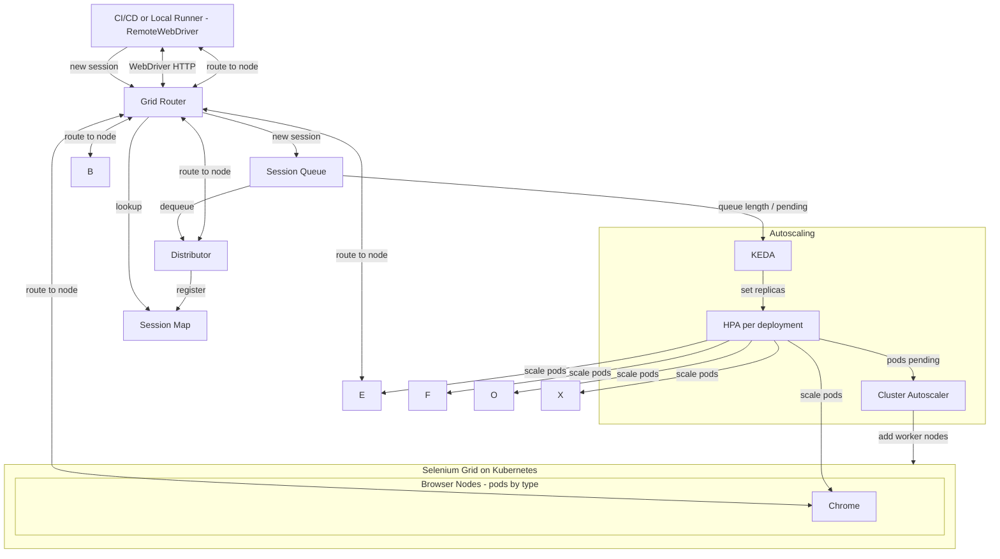

```mermaid
flowchart TD
A[CI/CD or Local Runner - RemoteWebDriver] -->|new session| R[Grid Router]
R -->|new session| Q[Session Queue]
R -->|lookup| M[Session Map]
Q -->|dequeue| D[Distributor]
D -->|register| M

%% --- Kubernetes + Grid ---
subgraph K8s_Grid [Selenium Grid on Kubernetes]
  direction TB
  subgraph Browser_Pods [Browser Nodes - pods by type]
    direction LR
    C[Chrome]
  end
end


A <-->|WebDriver HTTP| R
R <-->|route to node| A
R <-->|route to node| B
R <-->|route to node| C
R <-->|route to node| D
R <-->|route to node| E

%% --- Autoscaling path ---
subgraph Autoscaling [Autoscaling]
  direction TB
  K[KEDA]
  H[HPA per deployment]
  CA[Cluster Autoscaler]
end

Q -->|queue length / pending| K
K -->|set replicas| H
H -->|scale pods| C
H -->|scale pods| F
H -->|scale pods| E
H -->|scale pods| O
H -->|scale pods| X
H -->|pods pending| CA
CA -->|add worker nodes| K8s_Grid
```
