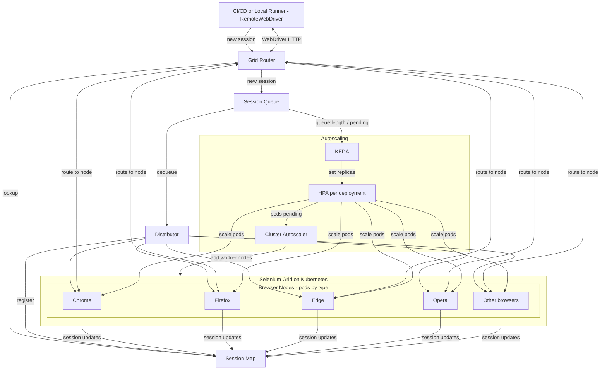

```mermaid
flowchart TD
A[CI/CD or Local Runner - RemoteWebDriver] -->|new session| R[Grid Router]
R -->|new session| Q[Session Queue]
R -->|lookup| M[Session Map]
Q -->|dequeue| D[Distributor]
D -->|register| M

%% --- Kubernetes + Grid ---
subgraph K8s_Grid [Selenium Grid on Kubernetes]
  direction TB
  subgraph Browser_Pods [Browser Nodes - pods by type]
    direction LR
    C[Chrome]
    F[Firefox]
    E[Edge]
    O[Opera]
    X[Other browsers]
  end
end

D --> C
D --> F
D --> E
D --> O
D --> X

C -->|session updates| M
F -->|session updates| M
E -->|session updates| M
O -->|session updates| M
X -->|session updates| M

A <-->|WebDriver HTTP| R
R <-->|route to node| C
R <-->|route to node| F
R <-->|route to node| E
R <-->|route to node| O
R <-->|route to node| X

%% --- Autoscaling path ---
subgraph Autoscaling [Autoscaling]
  direction TB
  K[KEDA]
  H[HPA per deployment]
  CA[Cluster Autoscaler]
end

Q -->|queue length / pending| K
K -->|set replicas| H
H -->|scale pods| C
H -->|scale pods| F
H -->|scale pods| E
H -->|scale pods| O
H -->|scale pods| X
H -->|pods pending| CA
CA -->|add worker nodes| K8s_Grid

```
